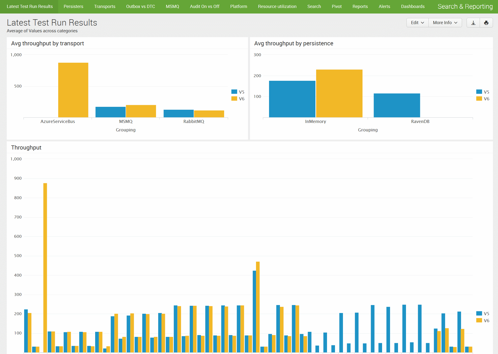
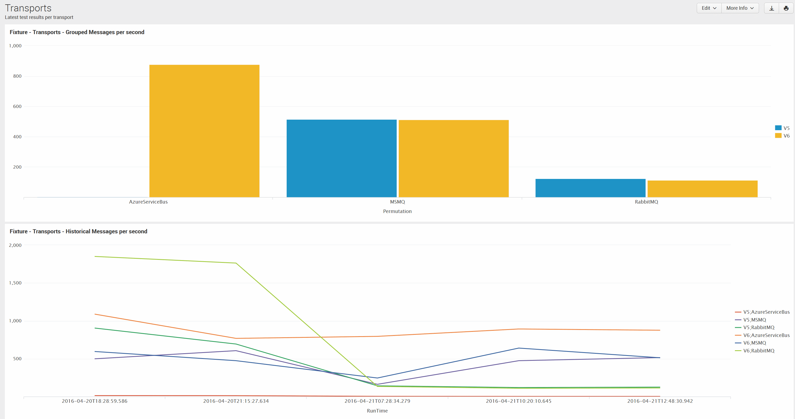

Performance Tests
===============

# Prerequisites for running tests

- Making sure that connection string to MS SQL DB is correct
- Creating empty database manually before first run

# Dependencies

In order to run all permutations you need:

- RavenDB
- SQL Server
- RabbitMQ
- Azure Service Bus
- Azure Storage Queue

All of these need a correct connection string. 

# Corflags.exe

In order to run the host as a 32 or 64 bit process the executable it patches using `corflags.exe` and we expect it here:

`%programFiles(x86)%\Microsoft SDKs\Windows\v10.0A\bin\NETFX 4.6.1 Tools\corflags.exe`

# How it all works

* Each persistence and transport has its own project. These projects target a specific major version for their two master dependencies (NServiceBus and the downstream package).
* Each NServiceBus major version has a host.
* The unit test project defines category fixture. Such a fixture defines a set of permutations.
* The permutations are generated as a NUnit data source.
* Then a test is run the permutation is generated to a folder.
* The generated permutation is invoked.
* The test waits until the run is finished or crashed but kills it if it takes too long.
* The results from the test run is published to a Splunk server for analysis

# Updating the results

All tests are run automatically when the PerformanceTests project is updated. Each test run could take up to 3 hours to complete, but results are published to Splunk as they complete.

If newer versions of the transport or persistence packages become available, the related performance test projects should be updated to ensure the tests are run using the latest versions. In the future this updating step could be automated.

# Viewing latest results

The results of the latest performance test run can be seen on the [Splunk dashboard](http://deploy.particular.net:8000/en-US/app/search/latest_test_run_results).  The username and password combination is stored within LastPass.

The initial dashboard will show a summary of the average throughput of each version for each test permutation.  The first two graphs at the top of the page show the Average throughput per transport, and the Average throughput per persistence.  It is important to note that these numbers are average values of all the permutations that contain those transports and persistences.

To drill into further detail, each fixture also has it's own dashboard.

####Example:

To drill into the details of the performance differences of the transports, click on the `Transports` link on the navigation menu. This will load the dashboard specific to the different Transport performance tests.

This dashboard shows the throughput of the individual tests included within the test fixture. In the case of the Transports test, a simple throughput comparison between `Azure Service Bus`, `MSMQ` and `RabbitMQ` are the current tests.

The second graph shows a historical track of the performance of the transports. This is helpful to prevent accidental investigations where a performance problem is actually due to an isolated environmental issue.

The other dashboards included allow the drilldown into the following fixtures:

* Persistors
* Outbox vs DTC (including message size permutations)
* MSMQ (Send vs SendLocal vs Receive)
* Audit vs Outbox vs DTC (including message size permutations)
* Platform (x86 vs x64, gc Server vs gc Client)
* Resource utilization (similar to platform, but with concurrency set to sequential)

# Future work

As soon as a new package is released (for alpha, beta, or release), the corresponding projects within the solution must have their nuget references updated to ensure that the new code is included within the test framework.  The same procedure should be followed for adding additional transports and persisters to the test framework which were not released at the original time of development. 